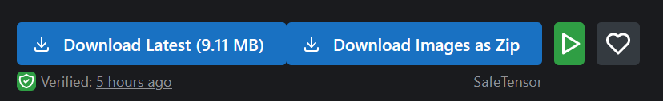
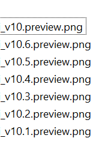

# CivitAI One Click DL

Adds a "Download Images as Zip" button to [CivitAi.com](https://civitai.com/) with all of them named correctly: `<model>.preview.png` and `<model>.<number>.preview.png` if there is more than 1 image

May break when trying to pick a different version of a model.
May add the model later if I can figure out CORS.

## Preview

New Download Button:

Images inside the ZIP:

## [Click to Install](https://github.com/tehrobber/civitai-one-click-dl/raw/master/dist/civitai-dl-btn.user.js)

#### Install instructions

- Firefox: Requires the [Violentmonkey](https://addons.mozilla.org/en-US/firefox/addon/violentmonkey/) extension. Click the Install link above.

- Chrome: Requires the [Tampermonkey](https://chrome.google.com/webstore/detail/tampermonkey/dhdgffkkebhmkfjojejmpbldmpobfkfo?hl) extension. Click the Install link above.

- Pale Moon: Requires the [Greasemonkey](https://addons.mozilla.org/en-US/firefox/addon/greasemonkey/versions/?page=2#version-1.15.1-signed) extension. Click the Install link above.

- MS Edge: Requires the [Tampermonkey](https://www.microsoft.com/store/apps/9NBLGGH5162S) extension. Click the Install link above.

- MS Edge Chromium: Requires the [Tampermonkey](https://www.microsoft.com/en-us/microsoft-edge/insider-addons/detail/iikmkjmpaadaobahmlepeloendndfphd) extension. Click the Install link above.

- Safari: Requires the [Tampermonkey](https://safari-extensions.apple.com/details/?id=net.tampermonkey.safari-G3XV72R5TC) extension. Click the Install link above.
